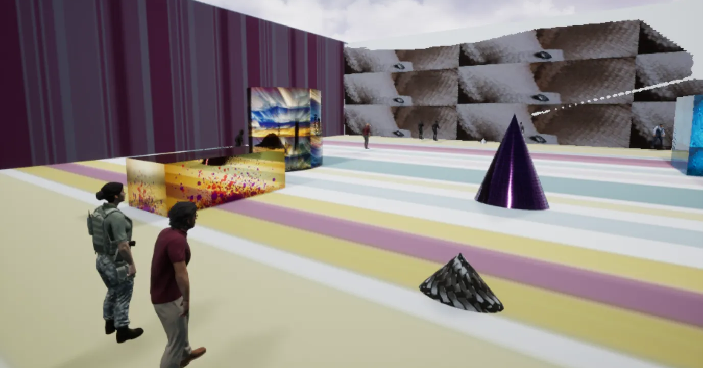
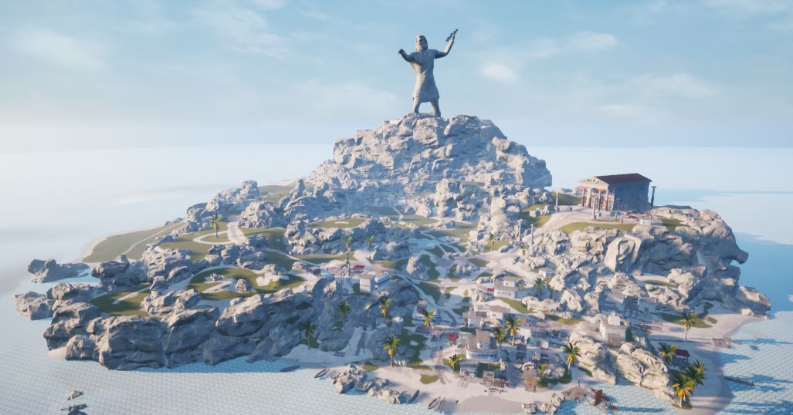
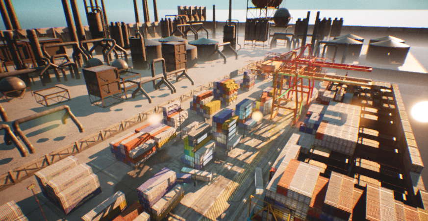
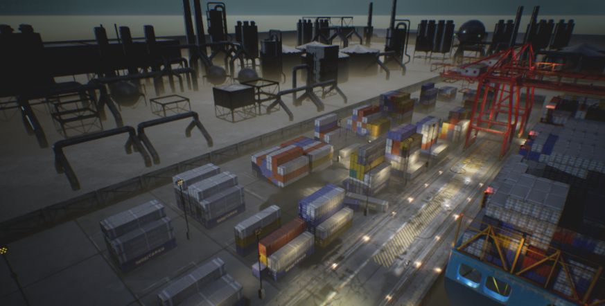
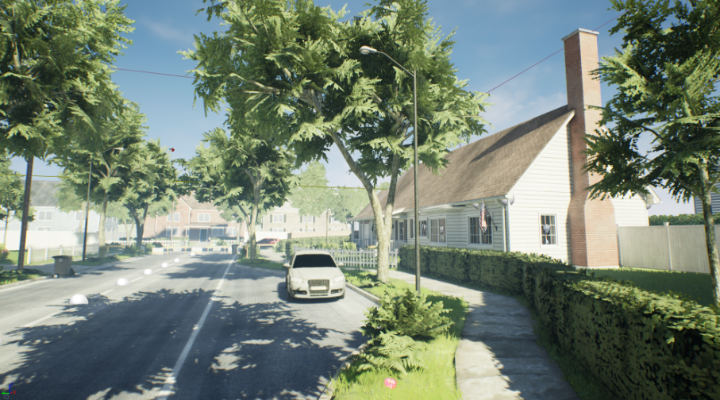
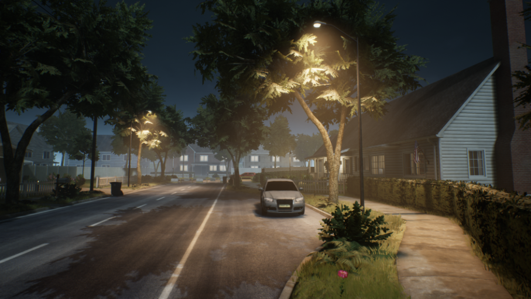
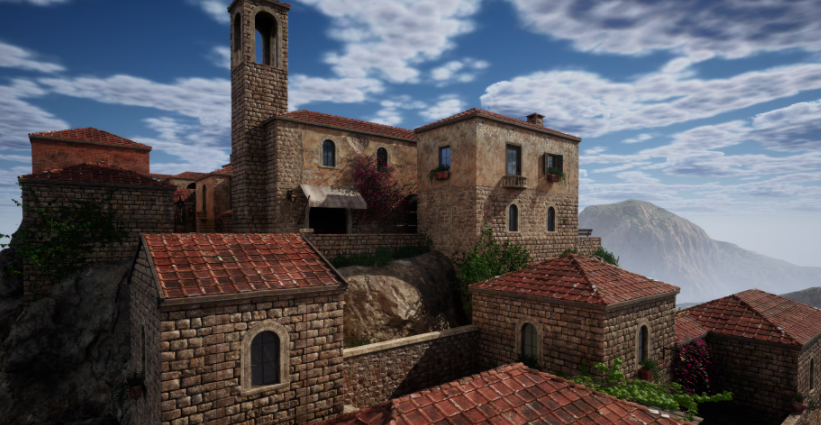
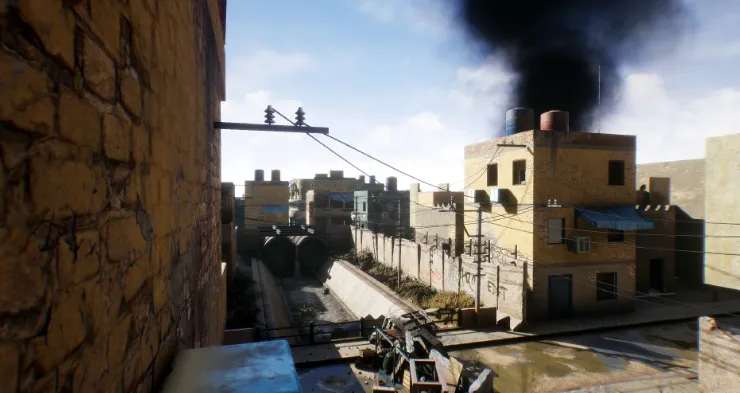
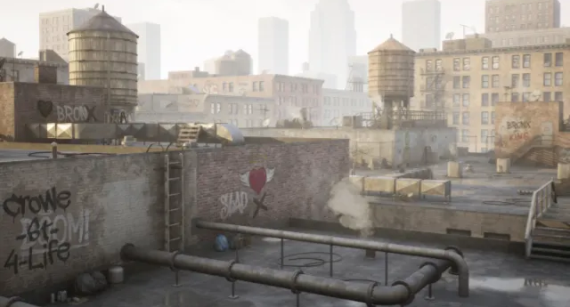
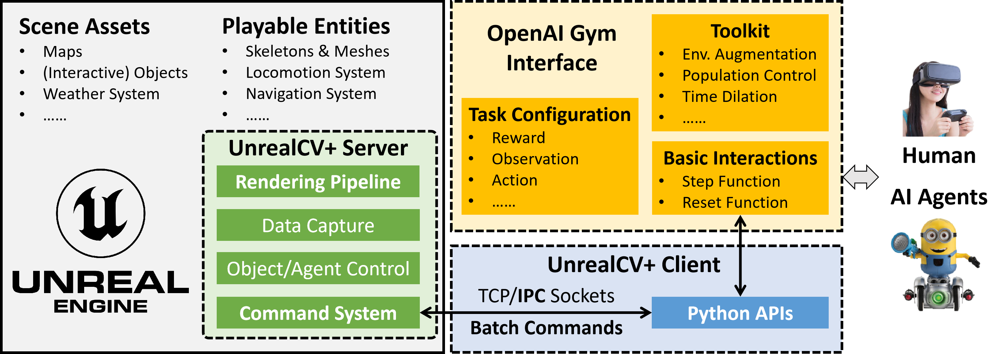

UnrealZoo: Enriching Photo-realistic Virtual Worlds for Embodied AI
===

# Introduction
**UnrealZoo is a suite of large-scale, photorealistic virtual environments designed to enhance the development of general visual intelligence, particularly for embodied AI. Leveraging the Unreal Engine and UnrealCV, these environments provide a scalable, controllable, and diverse play ground for AI agents, helping to speed up advancements in embodied artificial intelligence. The use of high-fidelity graphics and physics simulations allows for the study of complex interactive visual tasks in open worlds. We outline the technical framework of UnrealCV+, emphasizing its integration with machine learning pipelines and its utility in generating synthetic data for AI research. We demonstrate the applications of the virtual environments in developing the visual intelligence for embodied agents. This project concludes with a perspective on the future integration of multi-modal inputs and the role of UnrealCV+ in shaping the next generation of AI systems with advanced visual intelligence.**

To accommodate users' local memory limitations, we provide two different lightweight environment options based on **UE4 and UE5**. A larger preview-version environment package, which currently contain 50 scene maps (>60GB), is also available for download **here**. The full version of the UnrealZoo environment package will be released soon.

**UE4 Example Scenes**
<table>
  <tr>
    <td>
      <figure>
        
        <figcaption> track train</figcaption>
      </figure>
    </td>
    <td>
      <figure>
        
        <figcaption>Greek Island</figcaption>
      </figure>
    </td>
    <td>
      <figure>
        
        <figcaption>ContaineYard_Day</figcaption>
      </figure>
    </td>
  </tr>
  <tr>
    <td>
      <figure>
        
        <figcaption>ContainerYard_Night</figcaption>
      </figure>
    </td>
    <td>
      <figure>
        
        <figcaption>SuburbNeighborhood_Day</figcaption>
      </figure>
    </td>
    <td>
      <figure>
        
        <figcaption>SuburbNeighborhood_Night</figcaption>
      </figure>
    </td>
  </tr>
</table>

**UE5 Example Scenes**
<table>
  <tr>
    <td>
      <figure>
        
        <figcaption> ChemicalFactory</figcaption>
      </figure>
    </td>
    <td>
      <figure>
        
        <figcaption>Modular Old Town</figcaption>
      </figure>
    </td>

  </tr>
  <tr>
    <td>
      <figure>
        
        <figcaption>MiddleEast</figcaption>
      </figure>
    </td>
    <td>
      <figure>
        
        <figcaption>Roof-City</figcaption>
      </figure>
    </td>
 
  </tr>
</table>

# FrameWork


[//]: # (- ```UnrealCV``` is the basic bridge between ```Unreal Engine``` and ```OpenAI Gym```.)

[//]: # (- ```OpenAI Gym``` is a toolkit for developing an RL algorithm, compatible with most numerical computation libraries, such as TensorFlow or PyTorch. )
- The ```Unreal Engine Environments (Binary)``` contains the scenes and playable entities.
- The ```UnrealCV+ Server``` is built in the UE binary as a plugin, icluding modules for rendering , data capture, object/agent control, and command parsing. We have optimized the rendering pipeline and command system in the server.
- The ```UnrealCV+ Client``` provides Python-based utility functions for launching the binary, connecting with the server, and interacting with UE environments. It uses IPC sockets and batch commands for optimized performance.
- The ```OpenAI Gym Interface``` provides agent-level interface for agent-environment interactions, which has been widely used in the community. Our gym interface supports customizing the task in a configuration file and contains a toolkit with a set of gym wrappers for environment augmentation, population control, etc.


# Installation
## Dependencies
- UnrealCV
- Gym
- CV2
- Matplotlib
- Numpy
- Docker(Optional)
- Nvidia-Docker(Optional)
 
We recommend you use [anaconda](https://www.continuum.io/downloads) to install and manage your Python environment.
```CV2``` is used for image processing, like extracting object masks and bounding boxes. ```Matplotlib``` is used for visualization.
## Install Gym-UnrealZoo

It is easy to install gym-unrealzoo, just run
```
git clone https://github.com/UnrealZoo/gym-unrealzoo.git
cd gym-unrealzoo
pip install -e . 
```
While installing gym-unrealcv, dependencies including [OpenAI Gym](https://github.com/openai/gym), unrealcv, numpy and matplotlib are installed.
`Opencv` should be installed additionally. 
If you use ```anaconda```, you can run
```
conda update conda
conda install --channel menpo opencv
```
or
```
pip install opencv-python
```

## Prepare Unreal Binary
Before running the environments, you need to prepare unreal binaries. 
You can load them from the following link:

| Environment                                    | Download Link                                                                                                 | Size       |
|------------------------------------------------|---------------------------------------------------------------------------------------------------------------|------------|
| UE4 Example Scene (Linux)                      | [Download](https://app.filen.io/#/d/67ced4e0-4828-4614-9a2d-a9f2360232a5#K7eiIfKYO8GBl7yneiK8kACcRucs5P5O)    | ~3GB       |
| UE4 Example Scene (Windows)                    | [Download](https://app.filen.io/#/d/f4bd1676-b739-4703-885e-df96f032bd84#BPXaTn3HFsGjQI5LRP12IUWvhLqwB3Fd)    | ~3GB       |
| UE4 Example Scene (Mac)                        | [Download](https://app.filen.io/#/d/a0e7fde8-f183-4cb8-8985-5f8d50b7f9b4#LjsLjrKeZxIjemUhzWp7VnJTulSxlpTy)    | ~3GB       |
| UE5 Example Scene (Linux)                      | [Download](https://app.filen.io/#/d/3982f3f5-c21e-400f-b920-0fd7f255a0c1#bgO3LKFfbmISGcYQHuOvliGetWDQMBEc)    | ~10GB      |
| UE5 Example Scene (Windows)                    | [Download](https://app.filen.io/#/d/bb512fa8-ac3a-4b96-ab40-770d262b19e7#2Xj8bDjRxVhdlL5RcmE6aZhC4S1VvMSb)    | ~10GB      |
| UE4_Scene_Collection_preview(Linux, 50 maps)   | [Download](https://app.filen.io/#/d/c3e1c06f-9d63-4c6f-8940-55b0812e922b#ZkTVetGo8EaF6TUNQV4rwtbEdFitstGD)    | **\>60GB** |
| UE4_Scene_Collection_preview(Windows, 50 maps) | [Download](https://drive.filen.io/d/9fc755ac-19b5-4284-9385-9387e9a5ee86#ZzGNVRVV8fyp99VJfPMehsTk0xH7cXcb)    | **\>60GB** |

[//]: # (`ENV_NAME` can be `RealisticRoom`, `RandomRoom`, `Arm`, etc. )

[//]: # (After that, it will automatically download a related env binary)

[//]: # (to the [UnrealEnv]&#40;gym_unrealcv/envs/UnrealEnv&#41; directory.)

[//]: # ()
[//]: # (**Please refer the ``binary_list`` in [load_env.py]&#40;load_env.py&#41; for more available example environments.**)

Then move the downloaded binary to the UnrealEnv  folder, which is our default location for binaries, the folder structures are as follows:
```
gym-unrealcv/  
|-- docs/                  
|-- example/                
|-- gym_unrealcv/              
|   |-- envs/    
|   |   |-- agent/     
|   |   |-- UnrealEnv/                    # Binary default location
|   |   |   |-- Collection_WinNoEditor/   # Binary folder
|   |-- setting/
|   |   |-- env_config/                   # environment config json file location  
...
generate_env_config.py                    # generate environment config json file
...
```
Run **generate_env_config.py** to automatically generate  and store  the config JSON file for the desired map
```
python generate_env_config.py --env-bin {binary relative path} --env-map {map name}  
# binary relative path : the executable file path relative to UnrealEnv folder
# map name: the user desired map for running.

#example:
python generate_env_config.py --env-bin Collection_WinNoEditor\\WindowsNoEditor\\Collection\\Binaries\\Win64\\Collection.exe --env-map track_train
```

## Run example codes

### Available Map Name in Exemplar Binary

| UE4                     | UE5                     |
|-------------------------|-------------------------|
| track\_train            | Map\_ChemicalPlant\_1   |
| Greek\_Island           | Old\_Town               |
| ContainerYard\_Day      | MiddleEast              |
| ContainerYard\_Night    | Demo\_Roof              |
| SuburbNeighborhood\_Day |                         |
| SuburbNeighborhood\_Night|                        |

#### Hint 💡 
- If your mouse cursor disappears after the game launches, press ``` ` ``` (the key above Tab) to release the mouse cursor from the game.

#### 1. Run random agents
User could choose a map from the available map list, construct a **register name** in the format： ```Unreal{task}-{map_name}-{action space}{Observation type}-v{reset type} ``` and run the random agent to interact with the environment.
```
python ./example/random_agent_multi.py -e UnrealTrack-track_train-ContinusouColor-v0
```
#### 2. Run a rule-based tracking agent 
```
python ./example/tracking_demo.py -e UnrealTrack-Greek_Island-ContinusouColor-v0
```

#### 2. Run a keyboard tracking agent 
```
python ./example/keuboard_agent.py -e UnrealTrack-Old_Town-MixedColor-v0
```